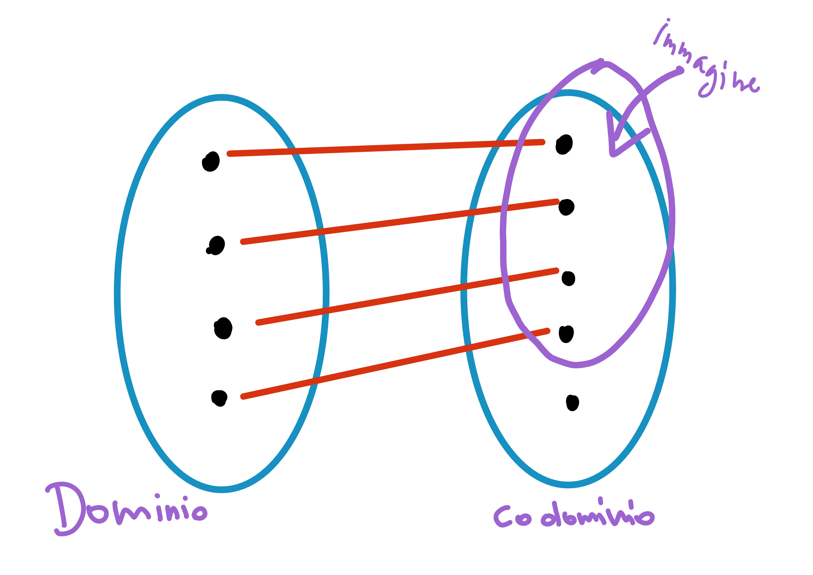
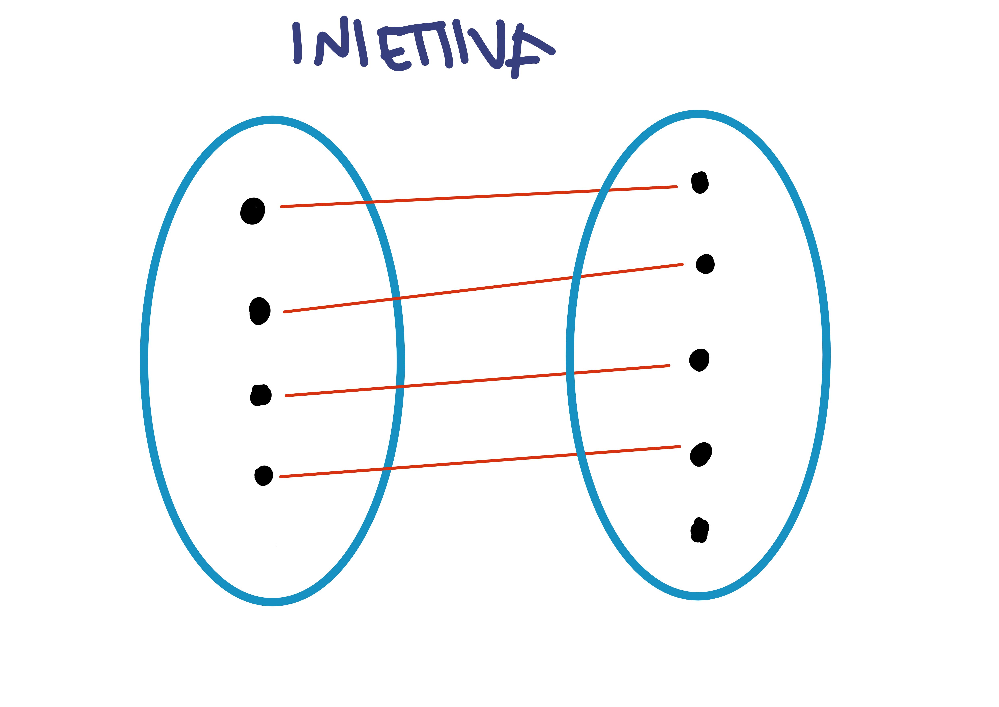
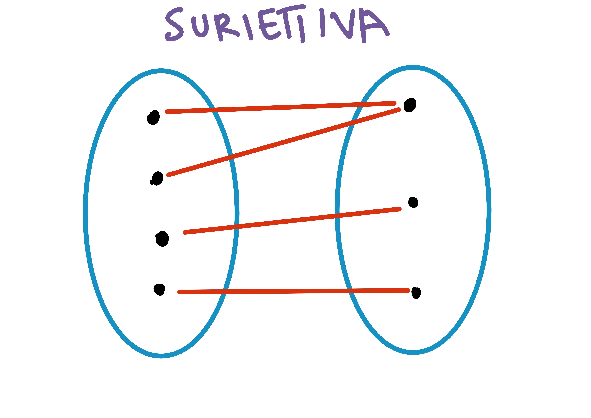
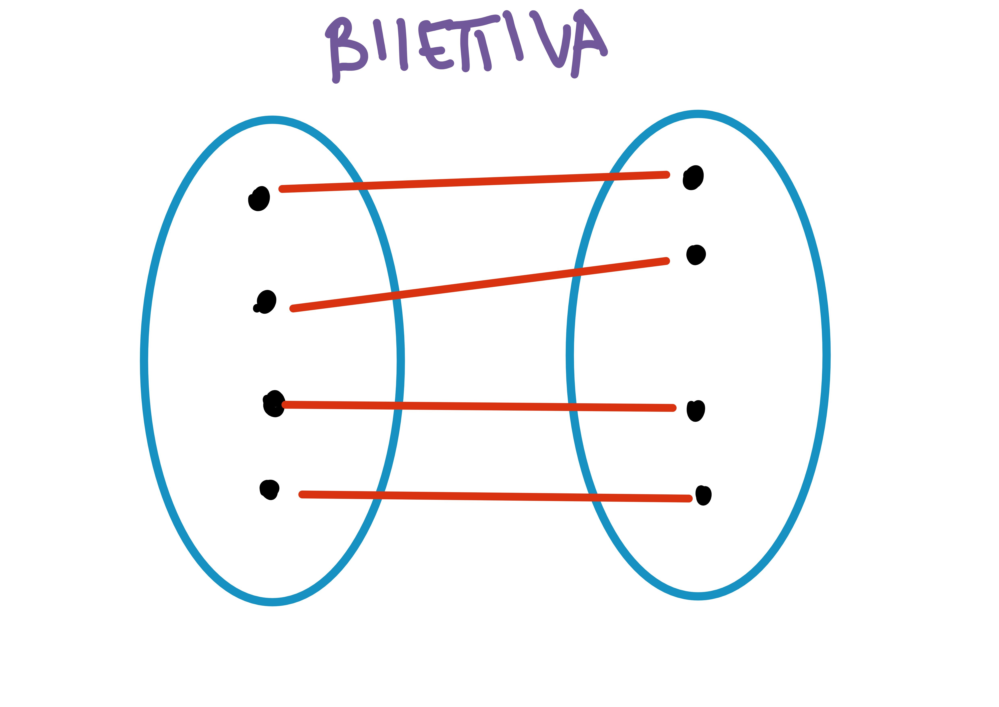

# Funzioni
- [Funzioni](#funzioni)
- [Proprietà delle funzioni](#proprietà-delle-funzioni)
  - [Funzione inettiva](#funzione-inettiva)
  - [Funzione suriettiva](#funzione-suriettiva)
  - [Funzione biiettiva (o biunivoca)](#funzione-biiettiva-o-biunivoca)
- [Composizione e inversione delle funzioni](#composizione-e-inversione-delle-funzioni)
  - [Funzione composta](#funzione-composta)
  - [Funzione parziale](#funzione-parziale)
  - [Funzione identità](#funzione-identità)
  - [Funzione inversa](#funzione-inversa)

Una funzione può essere vista come qualcosa che "invia" elementi da un set $A$ a un set $B$ - quindi può essere vista come una relazione speciale tra insiemi. s

> **DEFINIZIONE**: 
> Una funzione $f$ da un insieme $D$ (dominio) ad un insieme $C$ (codominio) ($f : D \to C$)
> è una relazione $R \subseteq D \times C$ tale che per ogni elemento $a \in D$, esiste uno e un solo $b \in D$ tale che $a \mathrel{R} C$
> quindi:
>>  1. ogni elemento di D ha un corrispondente in C
>> 2. nessun elemento di D ha più di un corrispondente in C 

Può succedere che più elementi del dominio siano associati allo stesso elemento del codominio (e.g. funzione costante) e si possono avere valori nel codomino a cui nessun elemento del dominio è associato (cioè, immagine e codominio possono o no coincidere).
Non ci possono essere però elementi del dominio associati a più elementi del codominio, o elementi del dominio che non sono associati a nessun elemento del codominio.

> **DEFINIZIONE**
> **Dominio**  $D$: tutti i possibili "valori di input" della funzione
**Codominio**  $C$: l'insieme in cui sono contenute le immagini della funzione (insieme di arrivo)
**Immagine** $Im$: l'insieme delle $b$ tali che $f(a) = b$ per qualche $a$, ovvero l'insieme dei valori assunti da una funzione sul proprio dominio. $Im \subseteq C$, cioè un sottoinsieme del codominio (con cui può coincidere). 
>> ovvero: se $X \subseteq B$, $f(X) = \{ x \in X: f(x) \in X\} \subseteq B$ 
>
> **Controimmagine**: è l'insieme di tutti gli elementi del dominio $D$; ogni elemento deve avere una relazione con il codomino $C$.
>> ovvero: se $Y \subseteq B$, $f^{-1}(Y) = \{ x \in A: f(x) \in Y\} \subseteq A$ 

# Proprietà delle funzioni
Alcune fuzioni hanno specifiche proprietà - esistono però funzioni (come la funzione costante) che non godono di nessuna di queste proprietà.

## Funzione inettiva
> **DEFINIZIONE**: 
> Una funzione si die ineittiva se per ogni coppia di elementi del dominio corrisponde una coppia di elmeenti del codominio
> ovvero data $f: A \to B$
>>  $\quad\forall a, a' \in A: ( f(a) = f(a') )\implies a = a'$

**Esempi**
- funzione lineare
- funzione espotenziale $\R \to \R$
- funzione quadrato $\N \to \N$ (ma non $\R \to \R$, che è suriettiva :) )
- funzione successore (non suriettiva, perché lo zero non è mai mappato da nessun $\N \to \N$)

## Funzione suriettiva
> **DEFINIZIONE**: 
> Una funzione si dice suriettiva, se ogni elemento del codominio ha corrisposta almeno una controimmagine nel dominio
> ovvero data $f: A \to B,$
>>$\forall b \in B: \exist a \in A \implies f(a) = b$

**Esempi**
- la funzione quadrato $\R \to \R$
- la funzione cubo $\R \to \R$
- funzioni periodiche come seno, coseno

## Funzione biiettiva (o biunivoca)
> **DEFINIZIONE**:
> Una funzione si dice biiettiva se è sia iniettiva che suriettiva 

Una funzione biiettiva si dice anche biuniovoca (one-to one): in una funzione biiettiva $f: A \to B$, A e B sono **equipotenti**, cioè tra i due insiemi vi è una **relazione di equivalenza**.

**Esempi**

# Composizione e inversione delle funzioni
## Funzione composta
>**DEFINIZIONE**
> 
> Date le funzioni $f: A \to B$ e $g: B \to C$, si dice funzione composta la funzione $g \circ f$ che ad ogni elemento $a \in A$ fa corrispondere l'elemento $g(f(a)) \in C$ 
> ovvero:
>> $S \circ R = \{ (a, c) | \exist b \in B: a \mathrel{R} b \land \ b \mathrel{S} c\}$

La composizione gode di proprietà associativa ma non commutativa, dunque $S \circ R \not = R \circ S$

## Funzione parziale
> **DEFINIZIONE**
> 
> Una funzione parziale si verifica quando quest'ultima viene definita da un sottoinsieme di $\R$ detto dominio di definizione (D), e aventi immagini reali.

Nel caso di composizioni tra funzioni bisogna prestare una certa attenzione all'applicazione della definizione di composizione di funzioni, in quanto, date due funzioni parziali $f: A \to B$ e $g: B \to C, il dominio di definizione $f \circ g$ potrebbe essere più piccolo dell'originale dominio di definizione di $f$.

## Funzione identità 
La funzione identità si verifica quando abbiamo una relazione $A \times A$ con $a \in A$, cioè $i_{a} = \{ (a, a): a \in A \}$. La funzione identità è biiettiva.

## Funzione inversa
Una funzione è invertibile se e solo se è biiettiva. Infatti, invertendo una funzione non-iniettiva o non-suriettiva si ottiene una relazione che non è una funzione. 

Combinando $f: A \to B$ con la sua invera $f^{-1}: B \to A$ si ottengono due funzioni di identità $f \circ f^{-1}(a) = a$ e $f \circ f^{-1}(b) = b$.

Per ogni funzione biiettiva c'è un'unica funzione inversa $f^{-1}$
