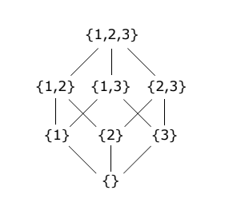

# Reticoli e algebre di Boole
- [Reticoli e algebre di Boole](#reticoli-e-algebre-di-boole)
  - [Reticoli $[L; \land; \lor]$](#reticoli-l-land-lor)
  - [Algebra di Boole](#algebra-di-boole)
    - [Convulazione](#convulazione)
    - [Leggi di De Morgan](#leggi-di-de-morgan)
  - [Omomorfismo](#omomorfismo)
  - [Teorema di Stone](#teorema-di-stone)

 

>**DEFINIZIONE**: Struttura algebrica
> Una struttura algebrica è un insieme dotato di operatori che soddisfano determinate proprieta o assiomi. Esempi di strutture algebriche sono i reticoli, i monoidi, i gruppi, gli anelli, e i campi.

Un **semireticolo** è un insieme parzialmente ordinato (POSET) che gode dell'operazione binaria di JOIN ($\lor$) per ogni insieme finito non-vuoto.

## Reticoli $[L; \land; \lor]$
Un **reticolo** è un insieme parzialmente ordinato (poset) per cui per ogni elemento esiste un estremo superiore (least upper bound) e estremo inferiore (greater lower bound) ed è dotato di due operatori binari, JOIN ($\lor$) e MEET ($\land$). 

Consider the poset we examined in . It isn't too surprising that every pair of sets had a greatest lower bound and least upper bound. Thus, we have a lattice in this case; and and .

Un reticolo gode delle proprietà commutativa, associativa, e identità e soddisfano la legge dell'assorbimento. Un **reticolo distributivo** è un reticolo dove ogni elemento è verificato dalla proprietà distributiva.

    Con JOIN intendiamo "il superiore tra"
    Con MEET intendiamo "l'inferiore tra"

Una rappresentazione alternativa è al JOIN e MEET, è considerare un insieme parzialmente ordinato $L = (A, \leq) \quad \quad \forall a, b \in A: \exist \ sup\{a, b\} \land  inf\{a, b\}$

[Lattice - Wolfram Alpha](https://mathworld.wolfram.com/Lattice.html)

## Algebra di Boole
>**DEFINIZIONE**
> 
> Un'algebra di Boole è un reticolo distributivo dove ogni elemento ha un complemento.
> 
E' quindi una struttura costituita da una sestupla: un insieme $A$, dotato di operazioni due operazioni binarie $\land$ MEET e $\lor$ JOIN, un'operazione unaria complemento $\lnot$ e due elementi 0 e 1 in A, denominati $\top$ top e $\bot$ bottom, tale che $\forall a, b, c \in A$ , valgano i seguenti assiomi:

**Associatività**
$$
a \lor (b \lor c) = (a \lor b) \lor c
\\
a \land (b \land c) = (a \land b) \land c
$$

**Commutatività**
$$
a \lor b = b \lor a 
\\
a \land b = b \land a
$$

**Assorbimento**
$$
a \lor (b \land a) = a
\\
a \land (b \lor a) = a
$$

**Identità \ Idempotenza**
$$
a \lor a = a
\\
a \land a = a
\\
a \lor \bot = a
\\ 
a \land \top = a

$$

**Distributività**
$$
a \lor (b \land c) = (a \land b) \lor (b \land c)
\\
a \land (b \lor c) = (a \lor b) \land (b \lor c)
$$

**Completento**
$$
a \lor \lnot a = \top
\\ 
a \land \lnot a = \bot
$$

 Si può considerare come una generalizzazione delle algebre dei sottoinsiemi potenza (e.g. insiemi potenza $\wp (\N$)

Infatti dato un insieme A:

$$
A = \{1, 2, 3\}
$$

Questa struttura algebrica inoltre ben rappresenta le proprietà essenziali sia della teoria degli insiemi che della logica - che è il motivo poi per cui è in questo corso.

### Convulazione
$\overline{\overline{A}} = \overline{A}$ sono uguali perchàe entrambe indicano "complemento di A"

### Leggi di De Morgan
Metodo per passare da OR a AND:

$\lnot (A \lor B) = (\lnot A) \land (\lnot B)$
$lnot(A \land B) = (\lnot A) \lor (\lnot B)$

The rules can be expressed in English as:

The negation of a disjunction is the conjunction of the negations
The negation of a conjunction is the disjunction of the negations

or

The complement of the union of two sets is the same as the intersection of their complements
The complement of the intersection of two sets is the same as the union of their complements

not (A or B) = (not A) and (not B) 
not (A and B) = (not A) or (not B)

## Omomorfismo

## Teorema di Stone

