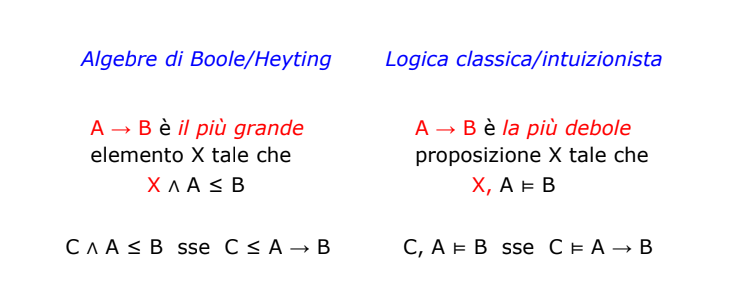

# Logica proposizionale
- [Logica proposizionale](#logica-proposizionale)
    - [Tavole di verità](#tavole-di-verità)
  - [Teorema di deduzione semantica](#teorema-di-deduzione-semantica)
  - [Equivalenza semantica](#equivalenza-semantica)
  - [Completezza funzionale](#completezza-funzionale)
  - [Enunciati validi e soddisfacibili](#enunciati-validi-e-soddisfacibili)
  - [Tableau proposizionali](#tableau-proposizionali)
    - [Metodo dei Tableau](#metodo-dei-tableau)
  - [Correttezza e completezza](#correttezza-e-completezza)
<br>


L'affermazione: *tutti i numeri naturali maggiori di due sono somme di due numeri primi" è un enunciato?
Sì, certo, è la **congettura di Goldbach**. Che nessuno ha mai dimostrato essere vera o falsa (anche se è verificata per numeri fino a $4*10^18), ma è sicuramente o vera o falsa.

Enunciati formati da una sola affermazione (e.g. "la neve è bianca") sono *enunciati atomici*, se prevedono connettivi logici (AND, OR, NOT), allora si dicono *enunciati composti*.

**Proposizioni atomiche**: P, Q, R, falso 
**Proposizioni composte**: $P \land Q$, $P \lor Q$, $P \implies Q$, $\lnot P$

Tenendo conto che i connettivi logici sono, in fondo, operazioni sugli enunciati, i connettivi saranno definiti mediante le *tavole di verità*.

**Sintassi**
Insieme delle proposizioni, ovvero oggetti sintatici (indicati con a,b)trutturate in diversi modi possibili: $P, Q, False, A \lor B, A \land A, A \implies B, \lnot A$

Simboli proposizionali P, Q: minima descrizione possibile della proposizione

**Semantica** (significato delle espressioni)
Modelli m: associanno simboli proposizionali ai valori di True o False attraverso le tavole di verità.

### Tavole di verità

| $A$ 	| $B$ 	| $\lnot A$ 	| $A \land B$ 	| $A \lor B$ 	| $A \implies B$ 	|
|---	|---	|---	|---	|---	|---	|
| V 	| V 	| F 	| V 	| V 	| V 	|
| V 	| F 	| (F) 	| F 	| V 	| F 	|
| F 	| V 	|  V 	| F 	| V 	| V 	|
| F 	| F 	| (V) 	| F 	| F 	| V 	|


## Teorema di deduzione semantica


Generalizzando:

$$
C_{1}, C_{2}, \dots, C_{n} \models A \implies B
$$

in cui $C_{1}, C_{2}, \dots, C_{n}$ sono **sequenti**, e se 
$$
n = 0 \quad \quad A \models B
$$


## Equivalenza semantica
> **DEFINIZIONE**
> Date due proposizioni A, B , esse sono semanticamnete equivalenti ($\equiv$) quando hanno gli stessi valori di verità per ogni interpretazione

**Esempi di equivalenze logiche**
$$
A \equiv \lnot \lnot A
\\
A \equiv A \land A
\\
A \equiv A \lor A
\\
A \implies B \equiv \lnot B \implies \lnot A
\\
A \implies B \equiv \lnot A \lor B
\\
A \land B \equiv \lnot (A \implies \lnot B)
\\
A \lor B \equiv \lnot (A \implies B)
\\
A \land B = \lnot (\lnot A \lor \lnot B) \ \text{legge di De Morgan}
\\
A \lor B = \lnot (\lnot A \land \lnot B) \ \text{legge di De Morgan}
$$

## Completezza funzionale
Per ottenere un operatore, è possibile utilizzarne altri due:
-  $\implies$ e $falso$
-  $\land$ e $\lnot$

Con queste due coppie di operatori possiamo ottenere tutti gli altri operatori e crearne di nuovi.

**Esempio**
XOR $\veebar$:

$$
A \veebar B \equiv (A \land \lnot B) \lor (B \land \lnot A)
$$

## Enunciati validi e soddisfacibili
>**DEFINIZIONE: enunciati soddisfacibili**
> 
> Un enunciato si dice soddisfacibile se è Vero per almeno un'interpretazione; in tal caso, questa interpretazione si dice modello per l'enunciato considerato

>**DEFINIZIONE: enunciati validi (tautologie)**
> 
> Un enunciato si dice valido se è Vero per ogni interpretazione. Si dice anche che l'enunciato è una tautologia.

>**DEFINIZIONE: enunciati insoddisfacibili**
> Un enunciato è insoddisfacibile se se è Falso per ogni interpretazione; ovvero per nessuna interpretazione assume il valore di verità Vero.

## Tableau proposizionali
Verificare la correttezza di una proposizione usando le tavole di verità è un metodo altamente inefficiente, visto che richiede $2^n$ passaggi. 

I Tableau Proposizionali sono un metodo più rapido per verificare le condizioni di una proposizione:
1. Viene creato un albero, che scompone la formula fino alla radice seguendo le seguenti regole:
   1. Se il nodo è $A \land B$, si valutano entrambe le proposizioni insieme $A,B$, visto che devono essere entrambe vere per essere soddisfacibili
   2. Se il nodo è $A \lor B$, si creano due nuovi nodi figli, valutando le proposizioni separatamente
   3. Se il nodo contiene una doppia negata $\lnot \lnot A$, si trasforma in $A$.

```
  A OR B          A AND B           NOT NOT A
  /     \             |                  |
 A       B           A, B                A
```

2. Arrivati alle foglie, si studia il risultato
        - *Insoddisfacibile*: se tutte le foglie contengono una proposizione e la sua negata, allora tutte le foglie si dicono "chiuse" e la proposizione studiata è insoddisfacibile.
        - *Soddisfacibile*: se almeno uno delle foglie non è chiusa, allora 
        - *Valida*: quando non esistono foglie chiuse

### Metodo dei Tableau
In realtà, è molto più facile e sicuro verificare se una formula è valida dimostrando che la sua negata è insoddisfacibile.

Quindi per verificare se una proposizione è una tautologia:
1. Si nega la proposizione
2. Si dimostra che con il metodo dei Tableau che è insoddisfacibile, ovvero che tutte le foglie sono chiuse

Tutti i Tableau sono finiti ed è facilmente dimostrabile per induzione strutturale, visto che ogni passaggio fondamentalmente riduce significativamente i connetivi presenti nel nodo e questi sono in numero finito. Quindi il processo deve terminare.

## Correttezza e completezza
**Correttezza**: un metodo si dice corretto se assegna un valore di verità corretto a qualunque proposizione dimostrabile. Se è dimostrabile, allora è valido.
**Completezza**:  se è valido, allora è dimostrabile.  Con questo metodo riusciamo a verificare tutte le proposizioni vere rispetto alle tavole di verità - un sistema è abbastanza potente se possiamo dimostrare tutto ciò che si può dimostrare.


The forward direction of Corollary 2.69 is called completeness: if A is valid, we can discover this fact by constructing a tableau for ¬A and the tableau will close. The converse direction is called soundness: any formula A that the tableau construction claims valid (because the tableau for ¬A closes) actually is valid. Invariably in logic, soundness is easier to show than completeness.

**DA VEDERE**: [Teorema incompletezza di Gödel](https://www.youtube.com/watch?v=I4pQbo5MQOs)

 